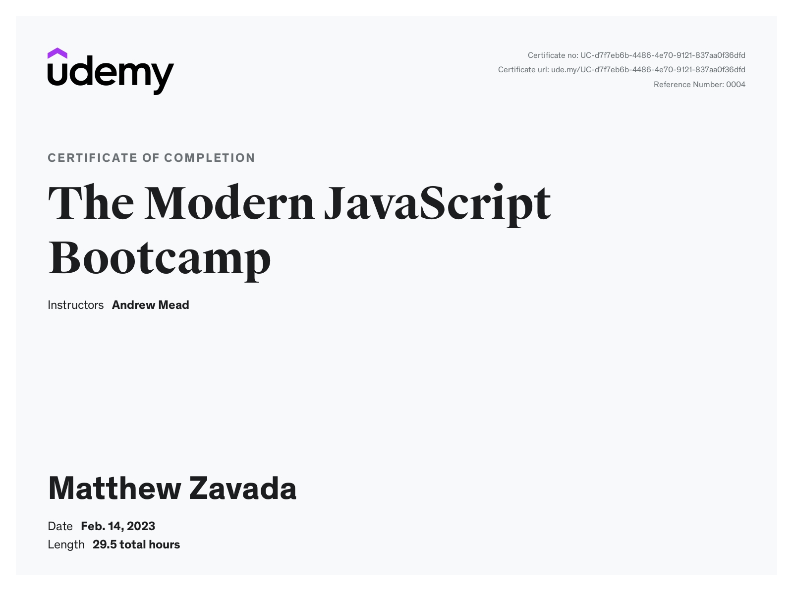

# The Modern JavaScript Bootcamp

## [Udemy course](https://www.udemy.com/course/modern-javascript/)

Challenge and course files from the course taught by [Andrew Mead](https://www.youtube.com/channel/UCScXYvmDD7hyFVX6X5ZwE_Q)

### Larger projects

- [Notes App](https://mattzavada.github.io/javascript-bootcamp/notes-app/public/index.html)
- [Todo App](https://mattzavada.github.io/javascript-bootcamp/todo-app/public/index.html)
- [Hangman App](https://mattzavada.github.io/javascript-bootcamp/hangman/public/index.html)

[Github Code files](https://github.com/mattzavada/javascript-bootcamp)

## Certificate

